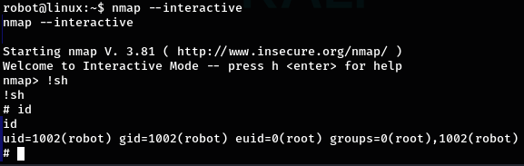

# Write-Up

# VulnHub: Mr. Robot

# Enumeration

I scanned my network using netdiscover to find the IP of the machine.

```
#netdiscover - r 192.168.100.0/
```

Looking at that list, i found that the ip is 192.168.100.

After finding the IP, i ran nmap to gather some infos regarding the ports and
running services

```
#nmap -sV 192.168.100.1 73
```


After that, I ran dirsearch to list out the potential hidden directories. I exclude
code 404 and 403 using -x to reduce unnecesary results.

```
#dirsearch -x 404,403 -u 192.168.100.
```

While waiting dirsearch to finish, i tried to find some common directories
manually.


I found out that the page is running wordpress, and i found something
interesting on robots.txt


I tried accessing key- 1 - of-3.txt and it gave me the first part of the flag

```
073403c8a58a1f80d943455fb30724b
```


The other interesting found which is fsocity.dic turns out to be a wordlist. After
checking it, I found that it has multiple duplicate entries which is redundant and
makes bruteforcing longer, so I decided to fix it.

```
#sort fsocity.dic | uniq > fsocity.uniq
```
At this point, the dirsearch are finished and its confirming my found that the
page is running wordpress


## Bruteforcing

I went to the admin login page, and after failing some random common defaults
user-password trials, I decided to bruteforce it using hydra and using the
wordlist I found from robots.txt

To start a bruteforce using hydra, i have to check first what are the parameters
from the form are named.


As for the hydra, here’s the command. A bit of explanation: -f is used so when
the right username is found, the hydra will exit. -vV is for verbose to show the
attempted passwords/username.

```
#hydra -L fsocity.uniq -p test123 -f -vV 192.168.100.173 http-post-form “/wp-
login.php:log=^USER&pwd=^PASS^&wp-submit=Log+In:F=Username invalid”
```


After running for about 5 minutes, i found a valid username which is elliot. Now
im gonna try to enumerate the password using that username.

```
#hydra -l elliot -P fsocity.uniq -f -vV 192.168.100.173 http-post-form “/wp-
login.php:log=^USER&pwd=^PASS^&wp-submit=Log+In:F=Username invalid”
```


Password found, now time to login into the admin dashboard.

## Gaining reverse shell

Im gonna edit the 404.php template to make it a php reverse shell using one of
the script from /usr/share/webshells.


Don’t forget to change the ip and port to the listening maching.

Before calling the reverse shell, don’t forget to set up a listener, here iam using
netcat

```
#nc -lnvp 4444
```

And we got a shell.

Here im gonna upgrade the shell using python so we can get the more
interactive one using

```
python3 -c 'import pty;pty.spawn("/bin/bash")'
```


## Privesc: robot

After looking around I found a user named robot and inside I found the second
flag which apparently only accessible to robot and a password hashed with md5.


I went to a hash cracker online and cracked the password


I tried to login to the user robot using that password, and apparently i succeeded
and able to retrieve the second flag


## Privesc: root

After goofing around for a while, i found that nmap has a set SUID.


```
#find / -perm -u=s -type f 2>/dev/null
```

I went to gtfobins but i don’t find a way to privesc using the provided
exploitation, so i search somewhere else and found about the option nmap has
which is ‘ _--interactive_ ’ which can give me a prolonged shell as root provided the
SUID bit are set.

```
#nmap --interactive
#!sh
```


Flag 3 retrieved, machine pwned!


